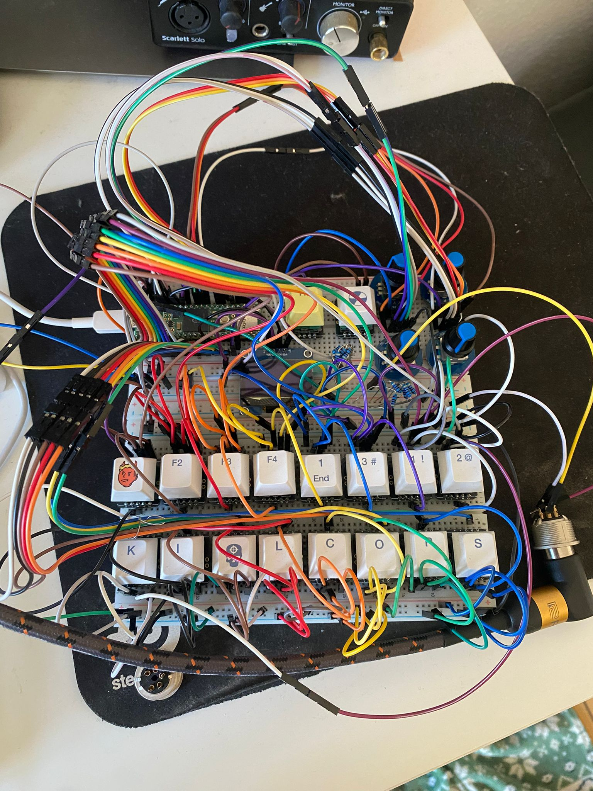

# seq-23: Sequencer Prototype (Work in Progress)


>[!WARNING]
>**Status:** WORK IN PROGRESS — ongoing prototype. Use at your own risk; expect frequent changes.

A 6-channel, 16-step MIDI sequencer for Teensy 4.1 driving an SH1106 OLED, a button matrix, six dual-pot+button controls, and MIDI out via Serial5.

> [!CAUTION]
> The code was entirely _vibe coded_ since I have no clue how to write C and C++. All LLMs used were free versions.

---

## Quick start

```bash
cd Sequencer_prototybe
platformio run
platformio run --target upload
```

Connect MIDI OUT (Teensy pin 20 / Serial5 TX) through a standard MIDI driver circuit to your target's MIDI IN. Open the PlatformIO serial monitor at 115200 baud to see firmware logs.

Pin mappings live in [include/SeqConfig.h](include/SeqConfig.h).

---

## Hardware layout

| Component | Pins | Notes |
|---|---|---|
| Button matrix | rows 6–10, cols 0–5 | 5×6 = 30 keys, row idle HIGH, columns scan |
| 6× pot + button | A pins 38/40/14/22/24/26, B pins 39/41/15/23/25/27, buttons 36/35/34/33/30/31 | Two analog inputs per pot for direction-aware turning |
| OLED (SH1106 128×64) | SDA 19, SCL 18 (I²C at 400 kHz) | Address 0x3C |
| MIDI OUT | Serial5 TX = pin 20, RX = pin 21, 31250 baud | Drives any standard MIDI receiver |

### Matrix index map

The matrix is row-major (`idx = row × 6 + col`). Verified assignments:

| Index | Button |
|---|---|
| 0–15 | Step buttons 1–16 |
| 16 | Page (transport modifier) |
| 17 | Fill (performance) |
| 18 | Menu 1 — Notes (Generative) |
| 19 | Menu 2 — Step Visualizer |
| 20 | Menu 3 — Euclid |
| 21 | Menu 4 — Trigger Machines |
| 22 | Function (modifier) |
| 23, 24, 25, 26, 28, 29 | Channel buttons CH6, CH5, CH4, CH3, CH2, CH1 |

If a physical button doesn't behave as expected, send `t` over serial to enter switch test and confirm the index.

---

## Transport

| Action | How |
|---|---|
| Play / Stop | Hold **Function** + tap **Page** |
| Tempo (BPM) ± 1 | Hold **Function** + rotate **Pot 1** anywhere |
| Save patch | Tap **Function** 5 times in a row (≤ 2 s between taps, no step held). `SAVED!` splash on success. |
| Clear EEPROM | Send `c` over serial |
| Clear current channel (and machine state, euclid, notes) | Hold **Function** + tap **Fill** — `CLEAR CH n` splash |

Internal MIDI clock runs from the Teensy hardware timer at 24 PPQN. If external clock (`0xF8`) is detected on MIDI IN, the firmware switches to external sync automatically; if it stops for > 2 s, it falls back to internal.

---

## Channels

Six independent tracks, each with its own pattern, MIDI Out channel, default note, velocity, mute state, machine, scale, etc.

| Action | How |
|---|---|
| Select channel | Tap **CH1..CH6** button |
| Mute / Unmute channel | Hold **Function** + tap **CHn** — `MUTE` splash with strikethrough |
| Open channel focus (mute + MIDI Out) | Hold **CHn** — OLED switches to focus view |
| Change MIDI Out channel for held channel | Hold **CHn** + rotate **Pot 1** (1..16, persisted per channel) |

Default MIDI Out mapping at first boot: `CH1 → MIDI ch 1`, `CH2 → ch 2`, … `CH6 → ch 6`. Persisted to EEPROM after a save.

---

## Step editing (any non-machine page)

The step buttons toggle the active channel's pattern. While a step is **held**:

| Encoder / Pot | Action |
|---|---|
| Tap **Function** | Cycle that step's Fill state (`NORMAL → FILL-ONLY`). Fill-only steps trigger only while the Fill button is held. Splash shows `STEP n FILL`. |
| Hold **Page** + turn pot 2 | (Reserved — see Notes page for fine pitch) |

When a step is turned off it resets all per-step P-Locks (pitch, gate, velocity, slide, ratchet, fill) so re-enabling starts clean.

The **Fill** button held = performance modifier: any step whose Fill state is `1` triggers; anti-fill (`2`) steps drop out. Holding Fill alone never re-arms cleared steps — it only filters.

---

## Pages (Menus)

Four pages, accessed by tapping the corresponding matrix button:

### Menu 1 — Notes (Generative)
Per-channel generative note engine. Per-step pitches are stored, not re-rolled on parameter changes — Pot 1 transposes; only Pot 2 button forces a re-randomize.

| Control | Action |
|---|---|
| Pot 1 (rotate) | Root note (transposes existing pattern) |
| Pot 1 (button) | Toggle generative mode (cycles scale 0 ↔ last used) |
| Pot 2 (rotate) | Scale mode: Major, Minor, Penta, Locrian, Dim, Atonal |
| Pot 2 (button) | Re-randomize note sequence |
| Pot 3 (rotate) | Gate length (11 divisions, see "Gate lengths" below) |
| Pot 4 (rotate) | Slide probability 0–100 % (re-rolls slides immediately) |
| Pot 5 (rotate) | Channel velocity 0–127 |
| Pot 6 (rotate) | Octave spread 0–60 semitones (granular, exponential bias toward root) |

When generative mode is enabled on a previously empty channel, all 16 steps are auto-enabled so you can hear the result immediately. Existing patterns are respected.

### Menu 2 — Step Visualizer
Read-only step grid showing the current channel's pattern, per-step state (Fill / Ratchet / Slide marks), and playhead.

### Menu 3 — Euclid
Classic Euclidean rhythm generator with reorganized pots:

| Control | Action |
|---|---|
| Pot 1 (rotate) | Pulses (number of triggers) |
| Pot 1 (button) | Toggle Euclidean engine on/off for the selected channel |
| Pot 2 (rotate) | Offset (rotates pattern) |
| Pot 3 (rotate) | Scale mode (when Euclid + scale active) |
| Pot 4 (rotate) | Channel velocity |
| Pot 5 (rotate) | Gate length |

### Menu 4 — Trigger Machines
Weight-table-based step generators per channel. Each machine has 16 step weights (0–100). A **density** parameter is the threshold: a step is on iff `weight ≥ (100 − density)`. Density 0 = only weight-100 (skeleton) steps; density 100 = everything weighted > 0.

| Control | Action |
|---|---|
| Pot 1 (rotate) | Machine type: OFF, KICK, HIHAT, SNARE, ANTIKICK, PERC, EUCLID |
| Pot 2 (rotate) | Density 0–100 (fast, full sweep in a fraction of a turn) |
| Pot 3 (rotate) | Shift 0–15 (rotates the whole pattern) |
| **Step button (1–16)** | Cycles the step's overlay state: `AUTO → FORCE-ON → FORCE-OFF → AUTO`. Persists across machine changes; only cleared by `Function + Fill`. |

Machines:
- **KICK** — 4-on-the-floor base (steps 1, 5, 9, 13 always on). Adds 1/8 offbeats then 1/16 in-betweens as density rises. At density ≥ 65, non-base steps become **ratchets**: 1 hit at 65–74, 2 hits at 75–84, 3 hits on the rarer 1/16 steps at 85+ (kick fills).
- **HIHAT** — Erodes from full 1/16 as density drops. Offbeats (3, 7, 11, 15) persist longest, downbeats next, in-betweens go first.
- **SNARE** — Backbeats on steps 5 and 13 dominate; light fills appear around them at high density.
- **ANTIKICK** — Between-kick steps (3, 7, 11, 15) as the skeleton; 1/8 in-betweens and downbeats fill in at higher density.
- **PERC** — Even 1/16 with weighting toward both onbeats and offbeats.
- **EUCLID** — Re-uses the Menu 3 Euclid pattern, with the Menu 4 shift applied on top.

OLED shows the resulting pattern grid with overlay marks: `+` inside a filled cell = force-on, line through an empty cell = force-off, faint dot in an empty cell = machine wanted it on but you overrode it off.

User P-Lock ratchets on Menu 3 (Step Visualizer) merge with machine ratchets — the trigger uses whichever is larger.

---

## Modifier combos cheat-sheet

| Combo | Effect |
|---|---|
| **Function + Page** | Play / Stop |
| **Function + Pot 1 turn** | BPM ± 1 with full-screen splash |
| **Function + CHn** | Mute / unmute channel n |
| **Function + Fill** | Clear current channel (pattern + machine + euclid + notes) |
| **Function × 5 (taps)** | Save patch to EEPROM |
| **Function + Menu1 button held over a step** | (Reserved for P-Lock fill toggle — see step editing) |
| **CHn held** | OLED focus view for that channel (mute + MIDI Out ch) |
| **CHn held + Pot 1 turn** | Change that channel's MIDI Out channel (1–16) |
| **Fill held** | Performance fill mode — fill-only steps trigger, anti-fill steps drop out |

---

## Gate lengths

11 divisions, in ticks (96 PPQN):

| Index | Name | Ticks |
|---|---|---|
| 0 | 1 (whole) | 96 |
| 1 | 3/4 | 72 |
| 2 | 1/2 | 48 |
| 3 | 3/8 | 36 |
| 4 | 1/4 | 24 |
| 5 | 3/16 | 18 |
| 6 | 1/8 | 12 |
| 7 | 3/32 | 9 |
| 8 | 1/16 (default) | 6 |
| 9 | 1/24 | 4 |
| 10 | 1/32 | 3 |

Slide steps automatically extend their gate past the 6-tick step boundary so the next note gets portamento on synths that support it. Non-slide steps end one tick early to leave room for envelope release.

---

## Save / load

EEPROM layout is versioned (current = **v6**, magic `13572472`). On boot, the firmware checks the magic and loads everything. If it doesn't match (e.g., first run after an update that bumps the version), the patch is blank with defaults.

Saved per channel: pattern, per-step pitches/velocities/slides/ratchets/lengths/fill states, mute, Euclid params, channel pitch/velocity, MIDI Out channel, generative slide probability, octave spread, trigger machine type + density + shift, and the 16-step machine overlay.

**To persist your work:** tap **Function 5 times in a row**. Without that, all changes are lost on reset.

To wipe EEPROM: send `c` in the serial monitor.

---

## Serial commands (USB)

Send these at 115200 baud:

| Command | Action |
|---|---|
| `t` | Run 10 s switch test — prints matrix index when a button is pressed/released |
| `e` | Run 10 s pot-button test |
| `r` | Print raw pot readings continuously (encoder/quadrature debug) |
| `m` | 2 s MIDI pin monitor |
| `d` | Cycle step division (whole / half / quarter / 8th / 16th) |
| `p` | Play a test note C3 on selected channel |
| `c` | Clear saved EEPROM state |
| `g` | Dump full diagnostic state (channels, steps, params) |

You'll also see live MIDI logs in the monitor: `NOTE_ON ch=… note=… vel=…`, `NOTE_OFF …`, `FILL_BTN HELD/RELEASED (matrix idx=17)`, `TRANSPORT PLAY/STOP`, etc.

---

## Visual feedback (OLED splashes)

| Splash | Trigger | Duration |
|---|---|---|
| `PLAY` / `STOP` (inverted full-screen) | Function + Page | 900 ms |
| `BPM nnn` (full-screen) | Function + Pot 1 | 1.5 s (refreshes per tick) |
| `CH n  MIDI OUT ch n` | CHn held | While held |
| `MUTE` / `ON` (bordered) | Function + CHn | 600 ms |
| `STEP n FILL/NORM` (bordered) | Function tap with step held | 700 ms |
| `CLEAR CH n` (inverted) | Function + Fill | 700 ms |
| `SAVED!` (large text) | Function × 5 taps | 600 ms |

---

## Defaults at first boot

- BPM: 200
- Channel pitch: **A1** (MIDI note 33, matches Rytm MK2 default trig note)
- Channel velocity: **100** for every channel
- MIDI Out: `CH n → MIDI channel n`
- Gate length: 1/16
- Scale (when gen mode enabled): Major
- Trigger machine: OFF

---

## Pin mapping (full reference)

See [include/SeqConfig.h](include/SeqConfig.h) for the authoritative list. Summary:

```
MATRIX_ROW_PINS[5]    = {6, 7, 8, 9, 10}   // inputs, pulled down externally
MATRIX_COL_PINS[6]    = {5, 4, 3, 2, 1, 0} // outputs, idle LOW
POT_A_PINS[6]         = {38, 40, 14, 22, 24, 26}
POT_B_PINS[6]         = {39, 41, 15, 23, 25, 27}
POT_BTN_PINS[6]       = {36, 35, 34, 33, 30, 31}
OLED1_SDA_PIN         = 19
OLED1_SCL_PIN         = 18
MIDI_TX_PIN           = 20   // Serial5 TX
MIDI_RX_PIN           = 21   // Serial5 RX
```

---

## Standalone MIDI test sketch

A minimal MIDI test for verifying hardware lives in a sibling project:
`Projects/MIDI_Test/`. It opens Serial5 at 31250 baud and sends C4 every second so you can confirm the Teensy → Rytm path before flashing the full firmware.

---

## Troubleshooting

| Symptom | Check |
|---|---|
| Rytm doesn't trigger | Run `MIDI_Test`. If that triggers but the sequencer doesn't, verify the channel's MIDI Out (`CHn held + Pot 1`) matches the Rytm track. Default trig note is **A1 (33)**. |
| Fill button doesn't print on serial | Send `t`, press Fill, note the index. If it's not 17, update `MATRIX_BTN_FILL_INDEX` in `include/SeqConfig.h`. |
| Patch doesn't survive reboot | You must tap Function × 5 to save. EEPROM version bumps (e.g., a firmware update) will reset to defaults. |
| External clock drifts | The firmware re-locks BPM from a 49-timestamp window (2 beats); transient jitter is smoothed. Sustained drift means the external master is unstable. |

---

## Contributing

This is a private prototype. To contribute or report bugs, open an issue or contact the author.

## License

See project root for any license files. No formal release license is guaranteed for this prototype.

---

_This project is actively under development — expect breaking changes._
