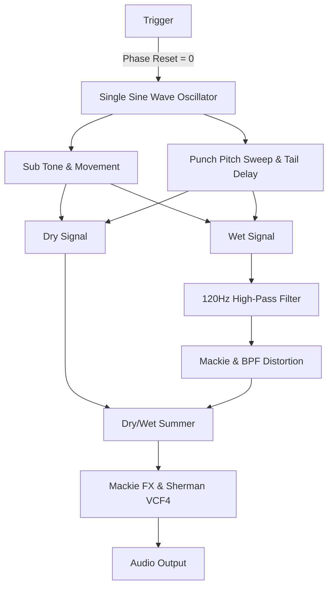

# Kick Redesign Plan

## 1. Branch Setup
- Create a new branch starting from commit `3af0e351c53dfff59cf02386a57bf5d8ddefa6cc`.
- Remove existing multi-oscillator sub and punch implementations inside `daisy-kick`.

## 2. Synthesis Simplification
- Single sine wave oscillator.
- Deterministic phase reset to 0 on every trigger to eliminate clicking.

## 3. Punch & Sub Characteristics
- **Punch**: Characterizes the pitch sweep (range 0 to 127, where 0 = no punch, 127 = laser punch). Tail velocity drives the pitch sweep.
- **Tail Delay**: Delays the tail so the punch can take space between when the tail starts.
- **Sub Movement**: Configurable sub movement (flat, pitch up, pitch down by % and amount).

## 4. Signal Routing & Filtering
- Sub and punch signals split into **Dry** and **Wet** paths.
- **Wet Path**: Passes through distortion filters (Mackie + BPF), with a 120Hz high-pass filter applied after processing.
- **Summer**: Dry and wet signals are added together before entering main FX processing (Mackie FX / Sherman).
- **Volume Control**: Individual sub and punch volume controls preserved via MIDI CC.

## 5. Architecture Diagram

